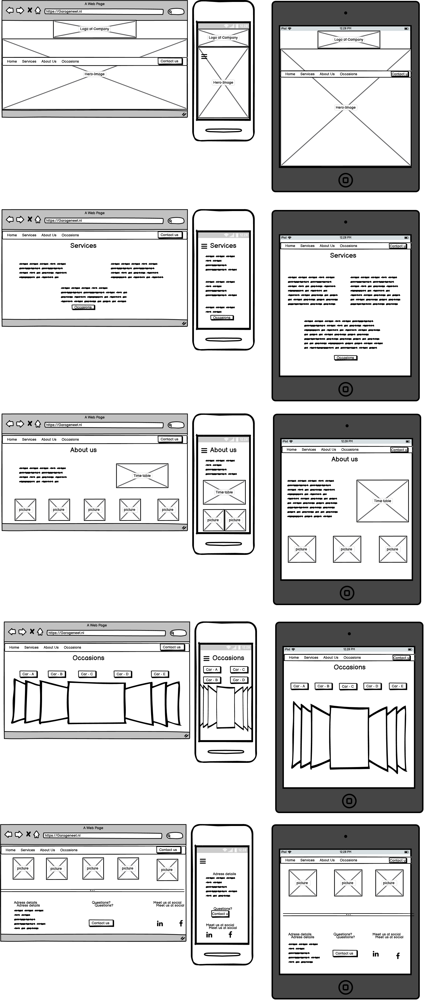

# Website for GARAGE NEET

Images coming soon

# GARAGE NEET 
Garage Neet is a website to present a garage specialized in in USA-CARS on the web. The main goal of the website is to give information about the services offered at the garage, as well attract new customers, and update customers about the newest occasions. Garage Neet is an existing garage and also the inspiration of this project. Currently, their website is very outdated and needed some restyle thus, this project came alive. 
This project is created as the first Milestone Project for Full Stack Web Development Course at Code Institute. 
Main objectives: 
-	objectives from code institute. 

#### Access the project
**Live:** ***coming soon***

**Repository:** Click [here](https://github.com/Dutchie1990/GarageNeet) to access the GitHub project.

# User Experience (UX)

##  User stories
- As a **new user**, I should be able get an overview of the services offered by Garage Neet. 
- As a **new user**, I should be able to navigate through the website easily. 
- As a **new user**, I should be able to easily link to social media pages of Garage Neet. 
    
- As a **potential car buyer**, I should get an overview of the current occasions with comprehensive information and images. 

- As a **business owner**, I have to give an overview of all the services offered at the garage.
- As a **business owner**, I have to give information about my opening times.
- As a **business owner**, I have to give information about address of the garage.
 
## Design
#### Colours
The main colours used at the website are based on the colours which are used for branding the company. The overall look of the website is a bit darkish to provide a manly atmosphere. 
The red colour and blue colours are coming from the colours: 
1. pantone 193 - HEX #BF0D3E
2. pantone 3015 - HEX #00629B
#### Typography
***Not decided yet***
### Images
Most of the images are supplied by the owner of the garage. Except the hero-image as this has to be a high-quality image and catchy. Only the most appealing pictures were used to make the website. 
### Wireframes

# Features
## Existing Features 
**Home page**

The home page is designed in compliance of the branding of the garage. The actual logo is used on top of the page as a eye-catcher and give the users the awareness of the brand. Secondly, there is an hero-image to make it even more appealing for the users. By opening the website, the navigation bar is located underneath the hero-image. The navigation bar is "sticky" and stick on top of the page when the user is scrolling down. 

**Services page** 

The services page give the user information on the services offered at the garage. As background of this page a parallax effect was used to give the user a "real" look into the garage working place. 

**About us page** 

The about us page give the user general information about the garage, as well a table with the opening times is included in this page.

**Occasions page**

At the occasions page there is an overview of the current cars on sale. The users should be able to toggle through the cars by clicking on the buttons with the names of the cars. The pictures of the car are shown in a carousel. Within this pictures should be a box with information on the car. 

**Footer**

The footer will give links to the social platforms of the garage. Also the address details of the garage are shown in the footer. The footer is shown on the very bottom of the scroll-through page as well at the bottom of the occasions page. 

**Contact form**

In the navigation bar, footer, occasions page as well in the about us page are possibilities to contact us. This will lead for a modal to pop-up with a contact form. In the form, the user can select the subject of the question: services, occasions, other.

## Features Left to Implement
**Email functionality**

The contact form is not wired up yet to send an email to the owner of the garage. This functionality is still left to be implemented. 

**Database storage for occasions**

The business owner had the wish to easily update their occasions on regular basis. This is not possible to achieve at this static website as there is no database storage for the cars which are on sale. The new features which is left to implement is an database with the cars and pictures stored which are shown on the occasions page. 

**Upload page + login for owner**

Another left to implement features is the possibility to log-in as admin and have an upload page where they can upload there occasions text and images which will be stored in the database and shown on the occasions page. 

# Technologies Used

# Testing

# Deployment

# Credits
https://dillinger.io/ for making ReadMe.md
https://1map.com/map-embed for providing the map
https://bbbootstrap.com/snippets/simple-navbar-hover-17011029 for effect at nav-bar
https://uicookies.com/css-hover-effects/ + https://www.youtube.com/watch?v=vBzrtrzlITE for zoom effect at images
https://getbootstrap.com/docs/4.0/components/scrollspy/ for scrollspy
