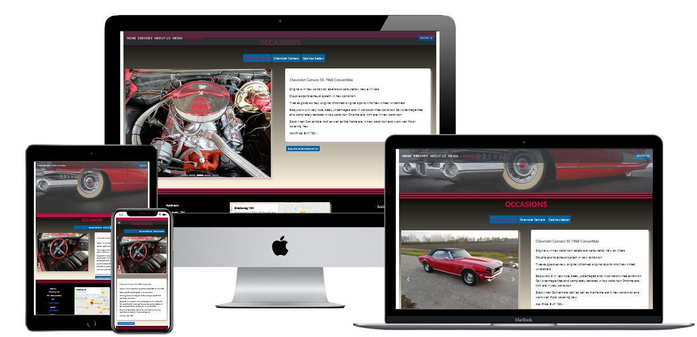
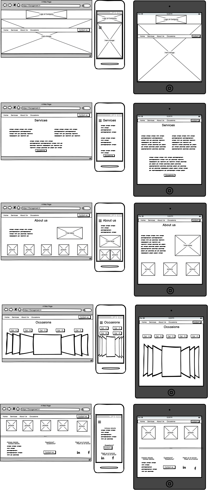
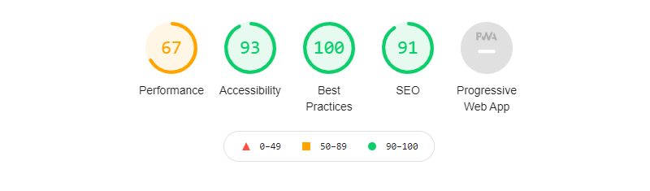

# Website for GARAGE NEET




# GARAGE NEET 
GARAGE NEET is a website to present a garage specialized in in USA-CARS on the web. 
The main goal of the website is to give information about the services offered at the garage, as well attract new customers, and update customers about the newest occasions. 
GARAGE NEET is an existing garage and also the inspiration of this project. 
Currently, their website is very outdated and needed some restyle thus, this project came alive. 

#### Access the project
**Live:** Click [here](https://dutchie1990.github.io/GarageNeet/occasions.html#occasions) to access the live website.

**Repository:** Click [here](https://github.com/Dutchie1990/GarageNeet) to access the GitHub project.

# User Experience (UX)

##  User stories
- As a **new user**, I want get an overview of the services offered by GARAGE NEET, so I decide if their services fits my needs. 
- As a **new user**, I want to navigate through the website easily,  so i can easily search the content I want to see. 
- As a **new user**, I want links to social media pages of GARAGE NEET, so I can engage with GARAGE NEET. 
    
- As a **potential car buyer**, I want an overview of the current occasions with comprehensive information and images, so can be be up to date with the occasions easily. 

- As a **business owner**, I have to give an overview of all the services offered at the garage, so I can inform potential customers.
- As a **business owner**, I have to give information about my opening times, so I can inform potential customers what times they can come by.
- As a **business owner**, I have to give information about address of the garage, so I refer to my website to see my location information.
- As a **business owner**, I have to give the opportunity to contact the garage, so customers can easily contact us.
 
## Design
#### Colours
The main colours used at the website are based on the colours which are used for branding the company. The overall look of the website is a bit darkish to provide a manly atmosphere. 
The red colour and blue colours are coming from the colours: 
1. pantone 193 - HEX #BF0D3E
2. pantone 3015 - HEX #00629B
#### Typography
The chosen typography for all the text is Arial, Helvetica, sans-serif to comply with the branding of the company. As well to increase the attractiveness of the website. 
### Images
Most of the images are supplied by the owner of the garage. Except the hero-image as this has to be a high-quality image and catchy. Only the most appealing pictures were used to make the website. 
### Wireframes


# Features

## Existing Features 

**Home page**

The home page is designed in compliance of the branding of the garage. The actual logo is used on top of the page as a eye-catcher and give the users the awareness of the brand. 
Secondly, there is an hero-image to make it even more appealing for the users. By opening the website, the navigation bar is located underneath the hero-image. 
The navigation bar is "sticky" and stick on top of the page when the user is scrolling down. 

**Services page** 

The services page give the user information on the services offered at the garage. 
The background of this page a parallax effect was used to give the user a "real" look into the garage working place. 

**About us page** 

The about us page give the user general information about the garage, as well a table with the opening times is included in this page.

**Occasions page**

At the occasions page there is an overview of the current cars on sale. 
The users should be able to toggle through the cars by clicking on the buttons with the names of the cars. 
The pictures of the car are shown in a carousel. Within this pictures should be a box with information on the car. 

**Footer**

The footer will give links to the social platforms of the garage. Also the address details of the garage are shown in the footer. 
The footer is shown on the very bottom of the scroll-through page as well at the bottom of the occasions page. 
The footer also provide a map of the location of the garage at higher screen resolutions. 
This functionality has been skipped at small screens as the footer expanded to unacceptable size.

**Contact form**

In the navigation bar, footer, occasions page as well in the about us page are possibilities to contact us. 
This will lead for a modal to pop-up with a contact form. 
In the form, the user can select the subject of the question: services, occasions, other. 
When the user clicks the occasions checkbox, there will be another row of checkboxes where the user can choose the car where they have questions about. 

## Features Left to Implement
**Email functionality**

The contact form is not wired up yet to send an email to the owner of the garage. This functionality is still left to be implemented. 

**Database storage for occasions**

The business owner had the wish to easily update their occasions on regular basis. This is not possible to achieve at this static website as there is no database storage for the cars which are on sale. The new features which is left to implement is an database with the cars and pictures stored which are shown on the occasions page. 

**Upload page + login for owner**

Another left to implement features is the possibility to log-in as admin and have an upload page where they can upload there occasions text and images which will be stored in the database and shown on the occasions page. 

# Technologies Used

#### Languages Used
- HTML5
- CSS3

The filter effect in the modal and in the occasions page where coded by HTML and CSS only. 
Based on the active checkboxes some content will be shown. 
The idea for this methodology coming from: https://webdesign.tutsplus.com/tutorials/how-to-build-a-filtering-component-in-pure-css--cms-33111

The zoom effect on the pictures in the about us section is based on the following tutorials: 

https://uicookies.com/css-hover-effects/ + https://www.youtube.com/watch?v=vBzrtrzlITE 

The pop-up with the contact form is a bootstrap modal. 

The navigation bar is a bootstrap navigation bar with sticky effect. 

The scrollspy is also provided by bootstrap. 

Furthermore, the layout is also based on bootstraps rows and collumns with some customized media queries.

The logo of the company is made by html with some custom styling. 
I have used the "hr-tag" to create the 3 lines in the logo and also applied it as a section seperator. 


#### Frameworks, Libraries & Programs Used

- [Bootstrap](https://getbootstrap.com/docs/4.4/getting-started/introduction/) for responsive design, navigation bar, popup modal, scrollspy and carousel. 
- [Fontawesome](https://fontawesome.com/start) for all the icons used at the website.
- [1Map](https://1map.com/map-embed) for providing embedded map.
- [Github](https://github.com) used to save repository and deploy website.
- [GitPod](https://gitpod.com) used as online IDE.
- [Balsamiq](https://balsamiq.com/wireframes/desktop/#) to make wireframes.
- Developer tools to test and inspect elements. 


# Testing

#### Manual testing: 

##### Bug: Modal resize background and navbar

When modal opens, the navbar and services background expands outside the container

This is caused by bootstrap modal. The bug was fixed by adding the following styles to the stylesheet:

```
.modal-open
{
    
    padding-right: 0 !important;
    margin-right: 0 !important;
    overflow: visible;

}
```
and 

```
.sticky-top
{
    padding-right: 0 !important;
    margin-right: 0 !important;
}
```

##### Bug: Scolling on small screen results in white space beneath services background

When scrolling down there is a white space in the background of the services page on small screens only.
This bug is shown at certain times, during a meeting with the mentor the bug doesnt come up so this bug will be ignored for now.

##### Bug: The footer of the index.html is bigger than the container

The footer was not inside the container-fluid class. The bug was fixed by putting the footer inside the container class div.

##### Bug:  Services link is broken

There were multiple elements with an id of services. I renamed the section id to #services-section to fix the bug. This change was made to index.html as well to the linking elements of occasions.html.

##### Bug:  The hamburger icon of the dropdown navbar was moving down as well

The position of the button in the Html file wasn't correct. It had to change above the link-items.

#### User story testing: 

- As a **new user**, I want get an overview of the services offered by GARAGE NEET, so I decide if their services fits my needs. 

During development I implement a services section where the user can read about the services offered at GARAGE NEET. 

- As a **new user**, I want to navigate through the website easily,  so i can easily search the content I want to see. 

I have implemented a navbar to easily navigate through the website. 
As well I applied scrollspy to discover the current location on the website of the user. 
This helps the user orientate where there are in the website. 

- As a **new user**, I want links to social media pages of GARAGE NEET, so I can engage with GARAGE NEET. 

In the footer of the page different links to common social media platforms are provided. 
All the links are opened in a different page to prevent the loss of the user.
    
- As a **potential car buyer**, I want an overview of the current occasions with comprehensive information and images, so can be be up to date with the occasions easily. 

On the occasions page there is textual information provided as well visual information about the cars which are on sale. 
The navigation is easy, by clicking on the buttons the car can be selected.

- As a **business owner**, I have to give an overview of all the services offered at the garage, so I can inform potential customers.

During development there is a services section added to provide information about the services of the garage. 
This section is the first section the user scroll to when they open the site as it is the most important information.
In this section there is also a link possibility to go to the occasions page which is the second most important page of the website. 

- As a **business owner**, I have to give information about my opening times, so I can inform potential customers what times they can come by.

In the about us section there is a timetable provided to give a clear overview of the opening times of the garage. 

- As a **business owner**, I have to give information about address of the garage, so I refer to my website to see my location information.

At bigger screensizes there is a embedded google map with the location on the garage as well the full adress which is also visible on smaller screens. 

- As a **business owner**, I have to give the opportunity to contact the garage, so customers can easily contact us.

At serveral places at the website there is possiblity to get in contact with the garage. 
Firstly, at the navbar there is always the possibility to hit the contact us button.
Furthermore, in the about us section there is a link to contact the garage. 
Lastly, at the occasions page its is possible to enquire information about the occasion.

 #### Validator 

 As validators the validators of w3.org were used. 

 - HTML validator - https://validator.w3.org/
 - CSS validator - https://jigsaw.w3.org/css-validator/

 When the code was checked by the html validator, there was a serieus issue with the index.html page. 
 This was caused by the body was a child of a div element. Several errors were fixed which shown at HTML-validation. 
 The warning about the h1 header in the sections was ignored. 


#### Lighthouse



General speaking, I am happy with the results of lighthouse assesment of the website. The performance should be the next issue to concentrate on in order to further optimize the website. 

# Deployment

The website is deployed at Github pages under following url: https://dutchie1990.github.io/GarageNeet/index.html#home. 

Steps to deploy: 
- Go to github.com
- Search for user: Dutchie1990
- Search for repository: GarageNeet
- Select the repository and navigate to settings
- Scroll down to github pages section
- Select master branch and choose for /root folder and click on save
- After a few minutes the website is deployed at mentioned url. 

# Credits

#### Media 

The hero-image is dowloaded at the folllowing [location](https://www.wallpaperflare.com/classic-red-convertible-coupe-car-rims-red-cars-wallpaper-240619/1920x1080).
All other media is provided by the busines owners. 

#### Content
All the content is written by me.

#### Acknowledgments
Thanks to my tutors and my mentor Spencer Barribal for valueable tips and tricks and helping me throughout the project. 
I would also like to thank the community on Slack for valuble input regarding the project.
Lastly, I want to thank my sister for providing a business cases to build the garage's website and my sister in law to walk through the website for testing. 